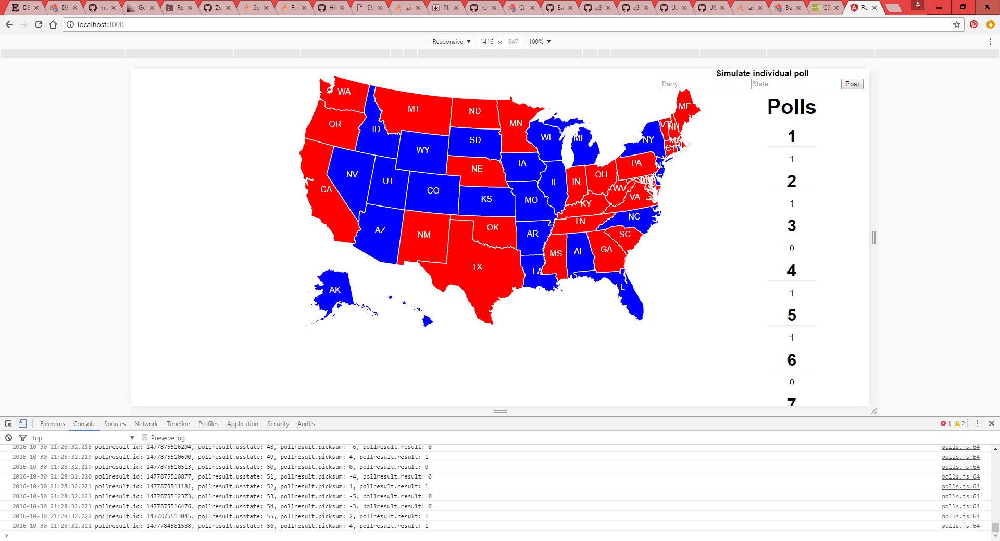

# REACT-D3-POLLTRACKER

 <b>In progress</b>

  <li>rewriting to ES6 syntax and using webpack</li>
  <li>changing form and rendered poll to results bars</li>

 <b>Description</b>

  Based on react-tutorial, see initial facebook comment in script.
  Also based on the geoAlbers map for d3 and uses us.json and us-state-names.tsv.

  Completely changed to create a dynamic polltracker.
  Current example is a random based poll simulating US presidential elections,
  but this structure could be adapted for any poll, for example using google adword ads.
  
  </img>

